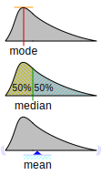

# Getting Started

Before running this notebook, select "Session > Restart R and Clear Output" in
the menu above to start a new R session. This will clear any old data sets and
give us a blank slate to start with.

After starting a new session, run the following code chunk to load the
libraries that we will be working with today.

```{r, include=FALSE, message=FALSE}
library(tidyverse)
```

I have set the options `include=FALSE` and `message=FALSE` to avoid cluttering
the solutions with all the output from this code.

# College Majors

The data for today is taken from [this paper](https://richmond.primo.exlibrisgroup.com/permalink/01URICH_INST/10lhjt5/cdi_crossref_primary_10_1016_j_econedurev_2016_04_007) by a senior economist
at the Federal Reserve Board:

> Douglas A. Webber, “Are College Costs Worth It? How Ability, Major, and Debt Affect the Returns to Schooling,” *Economics of Education Review* 53 (August 1, 2016): 296–310, <https://doi.org/10.1016/j.econedurev.2016.04.007>.

Webber uses information from the 2014-2018 American Community Surveys (a large
dataset compiled by the US Census Bureau) to estimate the lifetime earnings
of college graduate based on their undergraduate major. The dataset includes
not just a single number, but instead 99 data points for each major, which 
describes the distribution of estimated lifetime earnings for each major. 
You can read in the dataset with the following:

```{r, message=FALSE}
majors <- read_csv("../data/majors.csv")
majors |>
  slice_sample(n = 10)
```

It contains three fields:

- **major**        the name of the major
- **percentile**   percentile of earnings; includes every value from 1-99
- **earnings**     estimated lifetime earnings in millions of dollars

I do not believe that the estimates account for inflation.

In this notebook we will start by creating several different plots that use
this data to try to understand the relationship between college major and
lifetime earnings. We will then take a step back and consider how we can apply
the Data Feminism concepts from the notes to consider the implications and
limits of our analysis.

# Density Plots

To start understanding this dataset, we are going to make use of a new type of
geometry called `geom_density`. It is a bit different than previous geometries
we have used because rather than setting the y-aesthetic, we let the geometry
calculate the y-values based on the distribution of the values set to the `x` aesthetic.

## What is a density plot?

`geom_density()` estimates and visualizes the probability density function of a continuous variable. Here’s how it works:

Imagine you have a set of data points, like the heights of all the students in your class. If you wanted to see how these heights are distributed, you could create a histogram, which would count how many students fall into different height ranges (or "bins"). Those bins would include ranges (e.g., students between 4'0" and 4'11" in one group, 5'0" and 5'2" in another, etc.) The histogram would you the frequency of different height intervals.

However, histograms have some problems. Most obviously, they depend on the number of bins you choose, and they can look choppy or jagged.

This is where `geom_density()` comes in. Instead of counting data points in bins, `geom_density()` uses a method called [kernel density estimation](https://en.wikipedia.org/wiki/Kernel_density_estimation) to create a smooth curve that estimates the probability density function of the data.

This image helps explain how to interpret density plots:

{width=50%}

This general understanding is sufficient for our course. If you would like to learn a bit more about how this works, I recommend [this video](https://www.youtube.com/watch?v=t1PEhjyzxLA).

## Making a density plot

In the code block below, `filter` the data points from the major "Psychology"
and draw a ggplot graphic with `earnings` on the x-axis using a `geom_density()`
layer.

```{r, question-01}

```

## Shading

I find density plots easier to read if we shade the area underneath them with
a color. In the code below adapt your first plot by setting the `fill` aesthetic
to the fixed value "black" and the `alpha` aesthetic to the fixed value `0.3`.

```{r, question-02}

```

## Multiple densities

Let's compare the distribution of earnings from Psychology majors to two other
majors. In the code below, take just the rows from the majors "Psychology",
"Music" and "Art History" and draw a plot with `earnings` on the x-axis using
a `geom_density` layer. Set the `fill` aesthetic to the feature `major` and the
alpha value to 0.3.

```{r, question-03}

```

How would you describe the differences and similarities between
the estimated lifetime earnings of these three majors?

**Answer**:

# Plotting Percentiles

Let's now look at all of the majors in the data. In the plot below, take just 
the rows of the data corresponding to the 50th percentile of earnings (i.e., median earnings *within* a major). Draw a
scatterplot with earnings on the x-axis and major on the y-axis. Order the
majors from the smallest to the largest earnings.

::: {.callout-note title="Hint"}
One way to approach this would be to combine `mutate` with `fct_inorder` to order the `arrange`d majors for plotting, like so: `mutate(major = fct_inorder(major))`
:::

```{r, fig.height=10, question-04}

```

## Comparing Percentiles

The point of the data we have today is to go beyond a single number in order to
get a different picture of how major influences lifetime earnings. In the plot
below, create a new version of the previous plot, but include two dots for 
each major, one for the 25th percentile of earnings and another for the 75th
percentile of earnings. Color the 25th percentile in `"olivedrab"` and the 75th
percentile `"navy"`. Order the majors based on earnings from smallest to largest.

There are multiple ways to do this task. This time, use `mutate` and `if_else` to create a new color variable in your dataset. Then, use `scale_color_identity()` to map the colors in your new column to the points.

```{r, fig.height=10, question-05}

```

Repeat the previous question but produce a plot showing the 10th and 90th
percentiles of each major.

```{r, fig.height=10, question-06}

```

What is one important thing that you observe in the plots above?

**Answer**: Some majors have a wider *range* of possible earnings than others.
For example, the difference between the 10th percentile and the 90th percentile
of earnings for theology majors is much smaller than the difference between the
10th and 90th percentiles of earnings for median majors like Art History or
top-earning majors like Chemical Engineering.

## Comparing Percentages to Major

The 10th percentile of earnings for Chemical Engineers is $2.63 million USD over their lifetime. For each major, calculate the percentage of individuals expected to earn at least $2.63 million over their lifetime. This is done by finding the lowest percentile at which earnings meet or exceed $2.63 million for each major, and then computing `100 - percentile` to get the percentage. Arrange the majors based on this percentage and use `fct_inorder` to sort them accordingly. In the plot below, draw a scatter plot with the percentage on the x-axis and majors on the y-axis.

```{r, fig.height=10, question-07}

```

## Comparing Median Proportions

In the final plot, let's compare the actual differences in the median earnings
of each major. Filter to only include the 50th percentile of earnings and 
create a new variable `earnings_prop` that measures the earnings of each major divided by the
median earnings of all majors. Create a plot similar to the others above
where the majors are ordered from the lowest earnings to the highest earnings
with the proportion of median earnings on the x-axis. As this is our final graph for today, add `labs` to the plot that describe its axes. 

```{r, fig.height=10, question-08}

```

The shape won't be  much different than the previous plots, but the scale of
the x-axis is (to me) more interpretable than the abstract idea of "lifetime
earnings."

### Reflections

Data Feminism says that we should consider the values and power structures that
are baked into the data and data analyses that we do. What values seem to be 
expressed in the data here regarding college majors and life goals?

**Answer**: 

Data Feminism also says that data is never neutral or non-political. The data
here was an attempt to add nuance to studies focused only on a single summary
showing the relationship between college majors and earnings. Can you think of
another quantitative dataset that would help augment the story told by the data
we looked at above?

**Answer**: 

Can you think of a qualitative source of information that would help augment
the story told by the quantitative data?

**Answer**: 

It should be clear from these plots that while there is a relationship between
college majors and lifetime earnings, the situation is a bit more complicated
than the story told with a single number (say, the median earnings by major).
Can you construct a story that would use some of the results here to encourage
someone to major in a field that interests them rather than overly optimizing
for major that have the highest typical salaries?

**Answer**: 

It is also possible to turn the data visualizations here into a fairly negative
story about lifetime earnings. Try to describe in the most pessimistic way 
possible how you might summarize the data here. The goal of this exercise is to
show how data analysis is never neutral and the same results can be interpreted
very differently.

**Answer**: 
